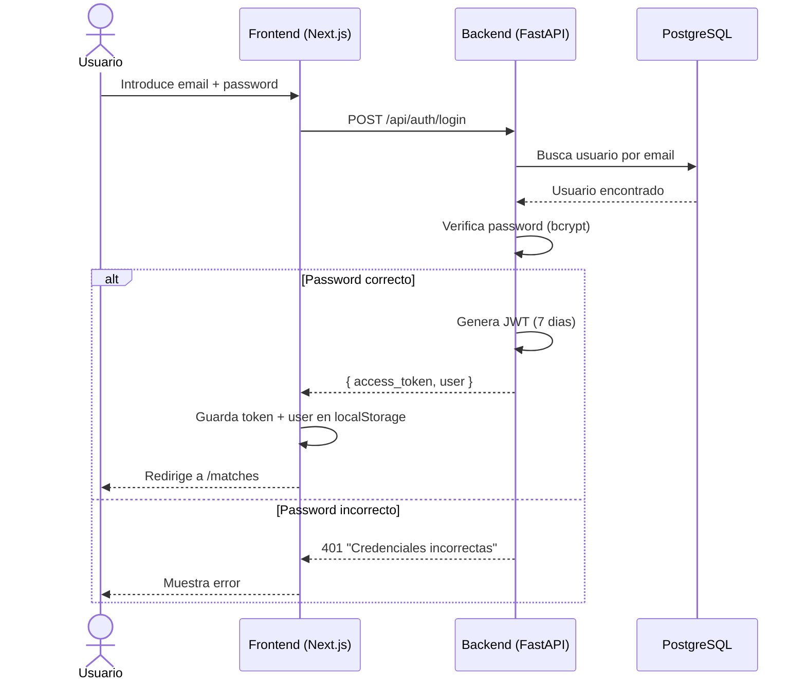
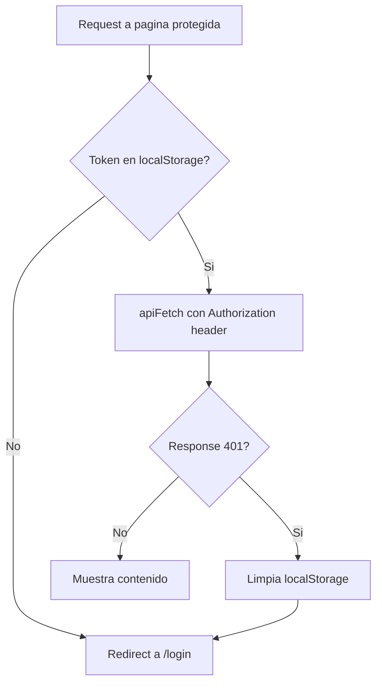
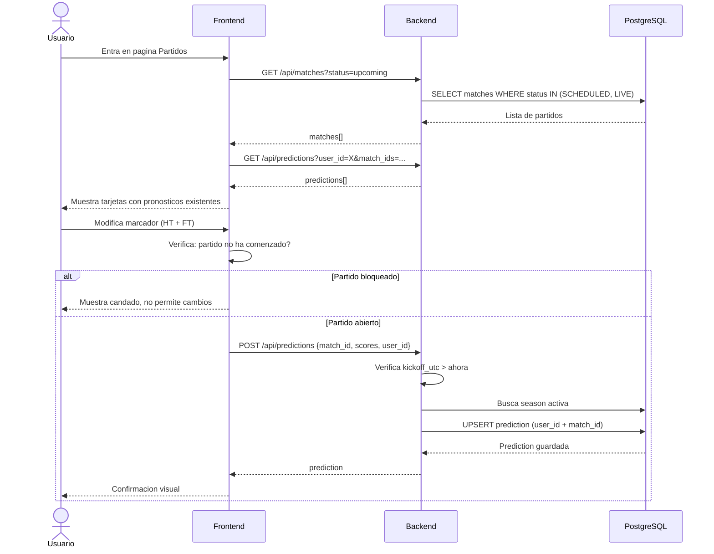
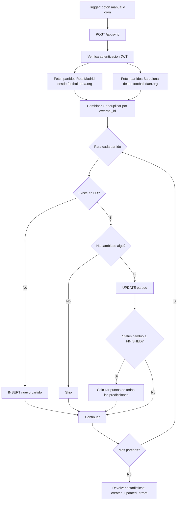
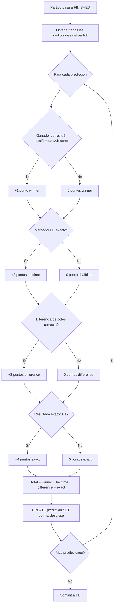
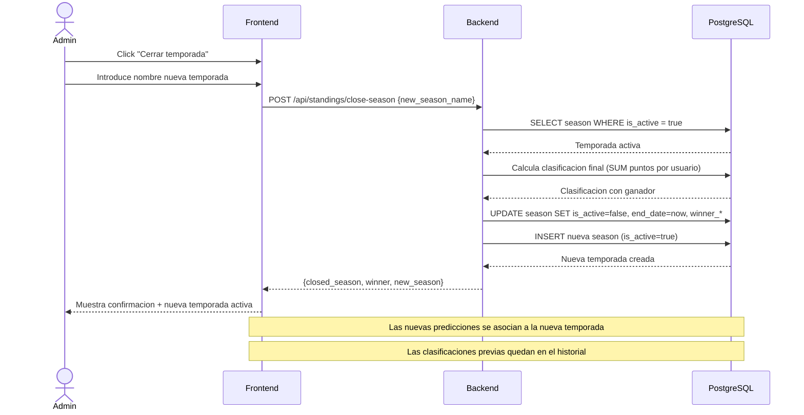
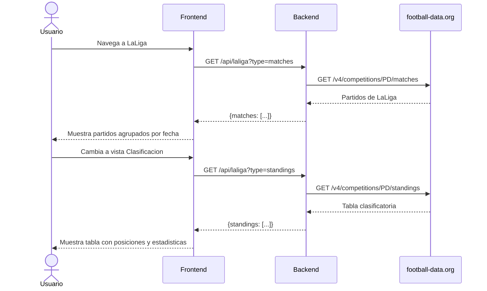

# BetSoccer — Flujos de Negocio

## 1. Flujo de autenticacion

### Verificacion en cada request

---

## 2. Flujo de pronostico

---

## 3. Flujo de sincronizacion de partidos

---

## 4. Flujo de calculo de puntos

### Ejemplo de puntuacion

| Criterio | Resultado real | Pronostico | Puntos |
|----------|---------------|------------|--------|
| Resultado FT | 2-1 (local gana) | 3-1 (local gana) | +1 (ganador correcto) |
| Marcador HT | 1-0 | 1-0 | +2 (HT exacto) |
| Diferencia goles | +1 | +2 | 0 (diferencia incorrecta) |
| Resultado exacto | 2-1 | 3-1 | 0 (no exacto) |
| **Total** | | | **3 puntos** |

---

## 5. Flujo de gestion de temporadas

---

## 6. Flujo de consulta de LaLiga

---

## Actores del sistema

| Actor | Descripcion | Acciones principales |
|-------|-------------|---------------------|
| **Jugador** | Miembro del grupo de amigos | Pronosticar, ver clasificacion, consultar historial |
| **Admin** | Jugador con acceso a gestion | Cerrar temporadas, recalcular puntos, crear usuarios |
| **Cron/Webhook** | Proceso automatico | Sincronizar partidos periodicamente |
| **football-data.org** | API externa | Proporciona partidos, resultados y clasificacion de LaLiga |
